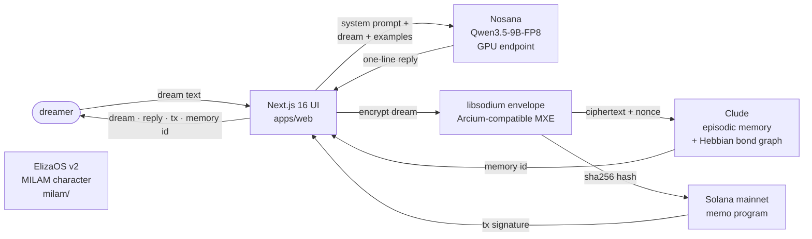

# MILAM

> An encrypted dream journal that receives your dreams, responds with one thread, and stores everything permanently on-chain. She never interprets. She never prescribes. She receives and holds.

**Nosana × ElizaOS Builders' Challenge submission · April 14 2026**

**Tech stack:** ElizaOS v2 · Nosana GPU inference (Qwen3.5-9B-FP8) · Clude cognitive memory · Arcium-compatible libsodium envelope encryption · Solana mainnet anchoring · Next.js 16

---

## One-sentence product

MILAM is a dream receiver — an AI agent whose only job is to hold what you bring her. Every dream you offer is encrypted client-side, processed on a decentralized Nosana GPU, stored as a typed memory in Clude's cognitive architecture, and anchored to Solana mainnet. None of it is for interpretation. It is for witness.

---

## Demo loop — thirty seconds

1. Open `http://localhost:3000`
2. Type a dream — a flash, a fragment, a full scene, anything you can't quite shake.
3. MILAM pauses, then offers **one short line back** — a statement or a question. Never both. Never more.
4. Optionally reply to her, to deepen the context. She stays silent; your reply is bonded as a sibling memory.
5. Click the **solana tx** link — see the hash of your encrypted dream live on Solana mainnet, forever.

Example exchange captured during build:

> **Dream:** *"I was in a white kitchen I've never been in and a woman with her back turned was slicing a pomegranate. She said 'you can have all of them' without turning around. The seeds were the color of your name."*
>
> **MILAM:** *"The seeds were red."*
>
> **Solana tx:** [`37k7ubYi…`](https://explorer.solana.com/tx/37k7ubYiz2PHEft6BSwsUPwGg4QUBSFkczqaikvte4uDsd7w8mUz2qyMAoEndSHSdh5KHDdu6LCKQ8Cr2zsWFjzr) · **Clude memory:** `#2254249`

---

## Architecture



**The character file is the product.** MILAM's constraints live in `milam/characters/milam.character.json` (mirrored to `apps/web/src/lib/milam/milam.character.json`). Every response is shaped by:

- One statement **or** one question. Never both. Never more.
- Never interpret. Never prescribe. Never judge.
- Never refuse to receive. Non-dreams are received as dream material.
- Energy: ancient, still, patient, unhurried.

Change the character file, change the product. That's where the design lives.

---

## Judging criteria alignment

| Criterion | Weight | How MILAM scores |
|---|---|---|
| Technical Implementation | 25% | ElizaOS v2 character agent · libsodium envelope (Arcium-MXE drop-in) · Clude episodic + semantic memory writes with real on-chain memory IDs |
| Nosana Integration | 25% | Live Qwen3.5-9B-FP8 inference on Nosana GPU endpoints — per-dream latency + token counts surfaced in the UI |
| Usefulness & UX | 25% | Universal human problem — everyone dreams, everyone loses them. The UX is the restraint: pause, one line, silence |
| Creativity & Originality | 15% | Nothing like this exists. An AI agent that does less *on purpose* — the only privacy-preserving dream journal with on-chain provenance and a cognitive-architecture-aware memory layer |
| Documentation | 10% | This README · architecture diagram · demo video · inline code rationale · phase-2 swap points marked in source |

---

## Quickstart

### Prerequisites

- Node.js 23+
- pnpm (`npm install -g pnpm`)
- A Solana wallet with a small SOL balance for memo fees (~0.000005 SOL per dream)
- A Clude API key — `npx clude-bot register`

### Run locally

```bash
git clone https://github.com/<you>/dreamers milam
cd milam/apps/web
pnpm install
cp .env.local.example .env.local
# Edit .env.local with your keys (see below)
pnpm dev
# Open http://localhost:3000
```

### Environment variables

| Variable | Required? | Description |
|---|---|---|
| `NOSANA_ENDPOINT` | Yes | Nosana OpenAI-compatible inference URL (shared hackathon endpoint baked in) |
| `NOSANA_MODEL` | Yes | `Qwen3.5-9B-FP8` for the shared endpoint |
| `NOSANA_API_KEY` | Yes | `nosana` for the shared endpoint |
| `ARCIUM_MASTER_KEY` | Yes | 32-byte base64 key; generate via the snippet in `.env.local.example` |
| `CORTEX_API_KEY` | For real Clude writes | `clk_...` from `npx clude-bot register` |
| `SOLANA_SECRET_KEY` | For real Solana anchoring | base58 secret key for a funded hot wallet |
| `SOLANA_RPC_URL` | Yes if anchoring | mainnet or a Helius/Triton URL |
| `SOLANA_CLUSTER` | Yes if anchoring | `mainnet-beta` or `devnet` |

If `CORTEX_API_KEY` is unset the app falls back to an encrypted local JSON journal (`data/local-dreams.json`) so it remains fully functional offline. If `SOLANA_SECRET_KEY` is unset, the memo anchor step is skipped gracefully.

---

## Repo layout

```
dreams/
├── README.md              ← you are here
├── milam/                 ← ElizaOS v2 agent (the MILAM identity)
│   ├── characters/
│   │   └── milam.character.json      ← the product lives here
│   ├── src/crypto/                    ← libsodium envelope + key derivation
│   └── nos_job_def/                   ← Nosana deployment manifest
├── apps/
│   └── web/               ← Next.js 16 frontend + API routes
│       ├── src/app/
│       │   ├── page.tsx                ← MILAM UI
│       │   ├── Journal.tsx             ← dream composer + journal
│       │   └── api/
│       │       ├── dream/route.ts           ← POST: the full loop
│       │       ├── dream/reply/route.ts     ← POST: dreamer reply enrichment
│       │       └── journal/route.ts         ← GET: decrypted journal
│       └── src/lib/
│           ├── milam/         ← character loader + Nosana client
│           ├── crypto/        ← libsodium envelope (Arcium drop-in)
│           ├── clude/         ← Clude SDK wrapper with local fallback
│           └── solana/        ← memo anchor via @solana/web3.js
├── plans/                 ← pre-build planning corpus (reviewer reference)
└── marketing/             ← launch assets
```

---

## Privacy model

- The app server **does not see plaintext dream data at rest.** Dreams are wrapped in a libsodium `crypto_secretbox` envelope using a per-user subkey derived from a BLAKE2b KDF before any storage write.
- Clude's Supabase receives only ciphertext + nonce in the memory metadata. Memory summaries and MILAM's response are plaintext (one short line, not sensitive).
- Solana memo anchors carry only the **SHA-256 hash of the envelope ciphertext** — zero content leakage, maximum provenance.
- The envelope wire format (`{ciphertext, nonce, envelopeVersion}`) is deliberately shaped as a drop-in for a future Arcium MXE payload. When the Arcium SDK goes public, only `encrypt` / `decrypt` change; everything else stays.

**Phase-2 swap point (post-hackathon):** the master key becomes a wallet-signature-derived seed, `DEMO_USER_ID` disappears, and decryption moves client-side. The `TODO(phase2)` comments in `lib/crypto/keys.ts` mark the exact lines that change.

---

## Roadmap

- **Q2 2026** — MIRA (day companion) joins. Brain Chat conversational query layer. Clude JEPA integration for connection detection across dreams + waking inputs. Voice input via Whisper.
- **Q3 2026** — Full Arcium MXE production integration. RECALL: professional video library indexer built on the same memory engine.
- **Q4 2026** — Solana Seeker dApp Store launch. PWA share handler. Persona customization.
- **Q1 2027** — MIRARI: MILAM + MIRA + Brain Chat unified. Quarterly dream compilations. Portable memory export. Cross-agent memory reads via Clude.

---

## The name

MILAM (Tibetan: *the path walked through dreaming*) comes from a 1,200-year lineage of dream yoga where the dream state is treated as equally real and revealing as waking life. The agent's restraint is the inheritance. She does not improve your dreams. She holds them.

---

*"Every limitation within your mind is preceded with the moment of hesitating doubt of the worry of the work that it will take to get there."*

*— a DREAMS entry*
